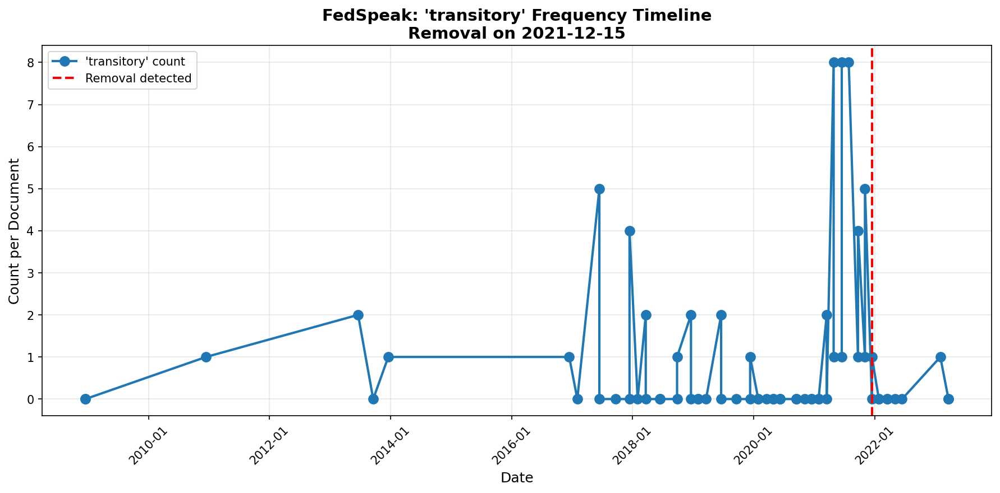

# FedSpeak Runbook

**Complete operational guide for detecting Federal Reserve language shifts**

---

## Table of Contents

1. [Quick Start](#quick-start)
2. [Installation](#installation)
3. [Basic Workflow](#basic-workflow)
4. [Command Reference](#command-reference)
5. [Understanding Output](#understanding-output)
6. [Common Use Cases](#common-use-cases)
7. [Configuration](#configuration)
8. [Troubleshooting](#troubleshooting)
9. [Advanced Usage](#advanced-usage)

---

## Quick Start

**Goal:** Detect the December 2021 "transitory" removal in 5 minutes.

```bash
# 1. Install dependencies
pip install -r requirements.txt

# 2. Download 2021 documents
python -m fedspeak.cli download --start-date 2021-01-01 --end-date 2021-12-31 --statements-only

# 3. Extract text from documents
python -m fedspeak.cli extract

# 4. Analyze keyword frequencies
python -m fedspeak.cli analyze

# 5. Detect language shifts
python -m fedspeak.cli detect

# 6. View results
ls results/alerts/
cat results/alerts/ALERT-20211215-removal-transitory.txt
```

**Expected result:** Alert showing "transitory" removed on December 15, 2021.

---

## Installation

### Prerequisites

- Python 3.8 or higher
- pip package manager
- Internet connection (for downloading Fed documents)
- ~50MB disk space for test corpus, ~500MB for full corpus

### Step-by-Step Installation

**1. Clone or download the project:**
```bash
git clone <repository-url>
cd FedSpeak
```

**2. Create virtual environment (recommended):**
```bash
python -m venv venv

# Activate on Linux/Mac:
source venv/bin/activate

# Activate on Windows:
venv\Scripts\activate
```

**3. Install dependencies:**
```bash
pip install -r requirements.txt
```

**4. Verify installation:**
```bash
python -m fedspeak.cli --help
```

You should see the FedSpeak command help.

**5. Check configuration:**
```bash
cat config/config.yaml
```

Default configuration tracks 5 keywords:
- transitory (+ synonyms: transient, temporary, short-lived)
- accommodative (+ synonyms: supportive, accommodating, easy)
- patient (+ synonyms: gradual, measured, deliberate)
- considerable time (+ synonyms: extended period, substantial period)
- full range of tools (+ synonyms: all available tools, complete toolkit)

---

## Basic Workflow

FedSpeak follows a 4-step pipeline:

```
┌─────────┐    ┌─────────┐    ┌─────────┐    ┌─────────┐
│ DOWNLOAD│───▶│ EXTRACT │───▶│ ANALYZE │───▶│ DETECT  │
└─────────┘    └─────────┘    └─────────┘    └─────────┘
   Get HTML      Clean text    Count words    Find shifts
```

### Step 1: Download Documents

**Download recent documents (last 2 years):**
```bash
python -m fedspeak.cli download --start-date 2023-01-01 --end-date 2024-12-31
```

**What happens:**
- Downloads FOMC policy statements and minutes
- Uses actual FOMC meeting calendar (eliminates 404 errors)
- Shows real-time progress bar
- Saves to `data/raw/`
- Automatically resumes if interrupted

**Options:**
```bash
--statements-only    # Skip minutes (faster, statements are primary)
--start-date         # Start date in YYYY-MM-DD format
--end-date           # End date (default: today)
```

**Example output:**
```
Downloading policy_statement: 100%|████████| 16/16 [00:25<00:00]
  success: 16, failed: 0

[SUCCESS] Download complete!
  Total: 16 documents
```

---

### Step 2: Extract Text

**Extract clean text from all downloaded documents:**
```bash
python -m fedspeak.cli extract
```

**What happens:**
- Processes HTML files in `data/raw/`
- Removes boilerplate (headers, footers, navigation)
- Handles format evolution (2008-2012 vs 2013+ layouts)
- Validates word count (ensures quality extraction)
- Saves clean text to `data/processed/`

**Options:**
```bash
--force    # Re-extract even if text file exists
```

**Example output:**
```
[EXTRACT] Processing 16 documents...

✓ Extracted 320 words from policy_statement_20230201a.html
✓ Extracted 315 words from policy_statement_20230322a.html
...

[SUCCESS] Extraction complete!
  Processed: 16/16 documents
  Success rate: 100%
```

**Common issues:**
- "Insufficient text" warning → Document is very short (check if correct URL)
- "Could not find main content" → Fed changed HTML structure (usually handled automatically)

---

### Step 3: Analyze Keywords

**Count keyword frequencies across all documents:**
```bash
python -m fedspeak.cli analyze
```

**What happens:**
- Reads extracted text from `data/processed/`
- Counts all keywords + synonyms in each document
- Calculates group totals (e.g., "transitory" + "transient" + "temporary")
- Computes 6-month rolling baselines
- Saves metrics to `data/metadata/keyword_metrics.csv`

**Example output:**
```
[ANALYZE] Analyzing 16 documents for 5 keywords...

✓ Analyzed policy_statement_20230201a.txt: {'transitory': 0, 'patient': 1, ...}
✓ Analyzed policy_statement_20230322a.txt: {'transitory': 0, 'patient': 1, ...}
...

[SUCCESS] Analysis complete!
  Documents: 16
  Observations: 240 (16 docs × 15 tracked words)
  Time-series saved: data/metadata/keyword_metrics.csv
```

**Understanding the output:**
- **Observations = docs × (keywords + synonyms + group totals)**
  - 5 keywords, each with 3 synonyms = 5 + 15 synonyms + 5 groups = 25 rows per doc
  - 16 docs × 15 trackable words = 240 observations

**View metrics:**
```bash
head -20 data/metadata/keyword_metrics.csv
```

Columns: `date`, `doc_id`, `doc_type`, `word`, `count`, `is_group`, `primary_word`, `baseline`

---

### Step 4: Detect Shifts

**Identify language shifts (emergence/removal):**
```bash
python -m fedspeak.cli detect
```

**What happens:**
- Loads keyword metrics from `data/metadata/keyword_metrics.csv`
- Detects shifts on **synonym group totals** (more robust than individual words)
- Uses 0-day detection algorithm (looks at past documents)
- Generates alerts with evidence and historical context
- Creates timeline visualizations
- Saves to `results/alerts/` and `results/visualizations/`

**Example output:**
```
[DETECT] Loading metrics from data/metadata/keyword_metrics.csv...

✓ REMOVAL: 'transitory' on 2021-12-15
  Baseline: 2.3 → Current: 0
  Confidence: HIGH

[SUCCESS] Detection complete!
  Shifts detected: 1
  Alerts generated: 2 files (JSON + text)
  Visualizations: 1 chart
```

**Output files:**
```
results/
├── alerts/
│   ├── ALERT-20211215-removal-transitory.json      # Machine-readable
│   └── ALERT-20211215-removal-transitory.txt       # Human-readable
└── visualizations/
    └── transitory_timeline.png                      # Timeline chart
```

---

## Command Reference

### Download Command

**Syntax:**
```bash
python -m fedspeak.cli download --start-date YYYY-MM-DD [options]
```

**Required:**
- `--start-date` - Start date (e.g., 2020-01-01)

**Optional:**
- `--end-date` - End date (default: today)
- `--statements-only` - Skip minutes (faster)

**Examples:**
```bash
# Download full 2021 corpus
python -m fedspeak.cli download --start-date 2021-01-01 --end-date 2021-12-31

# Download since 2020 (COVID era)
python -m fedspeak.cli download --start-date 2020-01-01

# Download recent year, statements only (fast)
python -m fedspeak.cli download --start-date 2024-01-01 --statements-only
```

**Resume interrupted downloads:**
Just re-run the same command. Already downloaded files are automatically skipped.

---

### Extract Command

**Syntax:**
```bash
python -m fedspeak.cli extract [options]
```

**Optional:**
- `--force` - Re-extract even if output exists

**Examples:**
```bash
# Extract all downloaded documents
python -m fedspeak.cli extract

# Force re-extraction (if Fed changed formats)
python -m fedspeak.cli extract --force
```

---

### Analyze Command

**Syntax:**
```bash
python -m fedspeak.cli analyze [options]
```

**Optional:**
- `--force` - Re-analyze even if metrics exist

**Examples:**
```bash
# Analyze all extracted documents
python -m fedspeak.cli analyze

# Force re-analysis (after config changes)
python -m fedspeak.cli analyze --force
```

---

### Detect Command

**Syntax:**
```bash
python -m fedspeak.cli detect
```

**Examples:**
```bash
# Detect shifts and generate alerts
python -m fedspeak.cli detect
```

---

### Report Command

**Generate summary report:**
```bash
python -m fedspeak.cli report
```

**Output:** Summary of detected shifts, corpus statistics, and keyword trends.

---

## Understanding Output

### Alert Files

**Text format (`ALERT-*.txt`):**
```
======================================================================
  FEDSPEAK LANGUAGE SHIFT DETECTED
======================================================================

Word: "transitory" (synonym group)
Shift Type: REMOVAL
Document: policy_statement - 2021-12-15
Confidence: HIGH

Change:
  2.3 → 0

  Synonym Usage:
    - transitory: 2 occurrences
    - transient: 1 occurrence
    - temporary: 0 occurrences

Historical Significance:
  Fed used "transitory" to describe inflation surge from April-November 2021.
  Removal in December 2021 signaled shift from temporary to persistent
  inflation framing, indicating policy pivot toward rate increases.

Evidence:
  Previous occurrences: 5
    - 2021-11-03: count=3
    - 2021-09-22: count=2
    - 2021-07-28: count=2

Timeline: results/visualizations/transitory_timeline.png
======================================================================
```

**JSON format (`ALERT-*.json`):**
```json
{
  "alert_id": "ALERT-20211215-removal-transitory",
  "timestamp": "2024-01-15T14:30:00",
  "shift_type": "removal",
  "word": "transitory",
  "document": {
    "doc_id": "monetary20211215a",
    "doc_type": "policy_statement",
    "date": "2021-12-15"
  },
  "change": {
    "previous_count": 2.3,
    "current_count": 0,
    "change_description": "2.3 → 0",
    "synonym_breakdown": {
      "transitory": 2,
      "transient": 1,
      "temporary": 0
    }
  },
  "synonym_details": {
    "primary_word": "transitory",
    "synonyms_present": ["transitory", "transient"],
    "synonym_counts": {"transitory": 2, "transient": 1, "temporary": 0}
  },
  "confidence": "high",
  "visualization": "results/visualizations/transitory_timeline.png"
}
```

---

### Timeline Visualizations

**Charts show:**
- **Dotted lines**: Individual synonyms (e.g., "transitory", "transient")
- **Bold line**: Group total (sum of all synonyms)
- **Red dashed line**: Shift detection date
- **Legend**: All tracked words

**Example:**


**Interpretation:**
- **Emergence**: Line rises from 0 (word starts appearing)
- **Removal**: Line drops to 0 (word stops appearing)
- **Synonym substitution**: One synonym decreases while another increases (group total stable)

---

### Keyword Metrics CSV

**File:** `data/metadata/keyword_metrics.csv`

**Columns:**
- `date` - Document date
- `doc_id` - Document identifier
- `doc_type` - policy_statement or fomc_minutes
- `word` - Tracked word/phrase
- `count` - Occurrences in document
- `is_group` - TRUE for group totals, FALSE for individual words
- `primary_word` - Main keyword (for synonyms)
- `baseline` - 6-month rolling average

**Example rows:**
```csv
date,doc_id,doc_type,word,count,is_group,primary_word,baseline
2021-12-15,monetary20211215a,policy_statement,transitory,0,False,transitory,2.3
2021-12-15,monetary20211215a,policy_statement,transient,0,False,transitory,0.8
2021-12-15,monetary20211215a,policy_statement,transitory_GROUP,0,True,transitory,3.1
```

**Use for:**
- Custom analysis in Excel/pandas
- Verification of detection logic
- Historical trend analysis

---

## Common Use Cases

### Use Case 1: Monitor Recent Fed Communications

**Goal:** Check if Fed changed language in the last 3 months.

```bash
# Download last 3 months (typically 1-2 meetings)
python -m fedspeak.cli download --start-date 2024-10-01

# Process pipeline
python -m fedspeak.cli extract
python -m fedspeak.cli analyze
python -m fedspeak.cli detect

# Check for alerts
ls results/alerts/
```

**Expected time:** 2-3 minutes

---

### Use Case 2: Validate Historical Shift

**Goal:** Confirm the December 2021 "transitory" removal.

```bash
# Download 2021 corpus
python -m fedspeak.cli download --start-date 2021-01-01 --end-date 2021-12-31 --statements-only

# Run pipeline
python -m fedspeak.cli extract
python -m fedspeak.cli analyze
python -m fedspeak.cli detect

# View alert
cat results/alerts/ALERT-20211215-removal-transitory.txt
```

**Expected result:** Alert on December 15, 2021 with baseline 2.3 → 0.

---

### Use Case 3: Full Historical Analysis

**Goal:** Analyze complete Fed communication history (2008-present).

```bash
# Download full corpus (takes ~60 minutes with rate limiting)
python -m fedspeak.cli download --start-date 2008-01-01 --statements-only

# Process pipeline (~5 minutes)
python -m fedspeak.cli extract
python -m fedspeak.cli analyze
python -m fedspeak.cli detect

# View all detected shifts
ls results/alerts/
python -m fedspeak.cli report
```

**Expected shifts:**
- "transitory" removal (Dec 2021)
- "accommodative" removal (Sep 2018)
- "patient" deletion (Mar 2015)
- "considerable time" substitution (Dec 2014)
- "full range of tools" addition (Mar 2020)

---

### Use Case 4: Add Custom Keyword

**Goal:** Track a new keyword (e.g., "soft landing").

**1. Edit config:**
```bash
nano config/config.yaml
```

**2. Add keyword to `keywords` section:**
```yaml
- word: "soft landing"
  type: "addition"
  context: "economic outlook"
  shift_id: "SHIFT-2024-01"
  significance: |
    Term describing Fed's goal to reduce inflation without causing recession.
  enabled: true
  priority: "medium"
  synonyms:
    - "smooth transition"
    - "gradual adjustment"
```

**3. Re-analyze and detect:**
```bash
python -m fedspeak.cli analyze --force
python -m fedspeak.cli detect
```

**4. Check results:**
```bash
ls results/alerts/ | grep "soft_landing"
```

---

### Use Case 5: Track Synonym Substitution

**Goal:** See if Fed switched from "transitory" to "transient".

**Check metrics:**
```bash
# View synonym usage over time
python -c "
import pandas as pd
df = pd.read_csv('data/metadata/keyword_metrics.csv')
df['date'] = pd.to_datetime(df['date'])

# Filter to transitory synonyms
synonyms = df[df['primary_word'] == 'transitory']
synonyms = synonyms[synonyms['is_group'] == False]

# Pivot to see synonym trends
pivot = synonyms.pivot_table(
    index='date',
    columns='word',
    values='count',
    fill_value=0
)
print(pivot)
"
```

**Interpretation:**
- If "transitory" decreases while "transient" increases → synonym substitution
- If both decrease → group removal

---

## Configuration

### Config File Location

`config/config.yaml`

### Key Settings

**Keywords to track:**
```yaml
keywords:
  - word: "transitory"
    synonyms: ["transient", "temporary", "short-lived"]
    enabled: true
    priority: "high"
```

**Detection parameters:**
```yaml
detection:
  sustained_removal_threshold: 3    # Past docs to check for removal
  baseline_window_months: 6         # Rolling baseline period
  min_baseline_samples: 3           # Minimum docs for baseline
  focus_document_type: "policy_statement"  # Primary source
```

**Paths:**
```yaml
corpus:
  start_date: "2008-01-01"
  data_dir: "data/"
  raw_subdir: "raw/"
  processed_subdir: "processed/"
```

**Download settings:**
```yaml
download:
  delay_seconds: 1          # Rate limit (respect Fed servers)
  retry_attempts: 3         # Max retries
  timeout_seconds: 30       # Request timeout
```

### Modifying Configuration

**After changing config:**
```bash
# Re-analyze to pick up new keywords
python -m fedspeak.cli analyze --force

# Re-detect with new parameters
python -m fedspeak.cli detect
```

---

## Troubleshooting

### Issue: No documents downloaded

**Symptoms:**
```
Batch complete: 0/8 successful
```

**Causes & Solutions:**

1. **404 errors (pre-2008 dates):**
   - Fed documents only available from 2008+
   - Solution: Use `--start-date 2008-01-01` or later

2. **Network issues:**
   - Check internet connection
   - Solution: Retry download (auto-resumes)

3. **Wrong date range:**
   - No FOMC meetings in range
   - Solution: Verify dates with Fed calendar

---

### Issue: Extraction failed

**Symptoms:**
```
✗ Failed to extract policy_statement_20210101a.html: Could not find main content
```

**Causes & Solutions:**

1. **Incomplete download:**
   - HTML file is corrupted
   - Solution: Delete file and re-download

2. **Fed changed HTML structure:**
   - New layout not recognized
   - Solution: Check if cascading selectors need update

3. **Not an FOMC document:**
   - Downloaded wrong document type
   - Solution: Verify URL pattern

---

### Issue: No shifts detected

**Symptoms:**
```
[SUCCESS] Detection complete!
  Shifts detected: 0
```

**Causes & Solutions:**

1. **Date range too narrow:**
   - No shifts occurred in period
   - Solution: Expand date range

2. **Keywords never appeared:**
   - Words not present in corpus
   - Solution: Check keyword_metrics.csv for actual usage

3. **Baseline too short:**
   - Not enough historical data
   - Solution: Download more documents (need 3+ for baseline)

---

### Issue: "Insufficient baseline data" warnings

**Symptoms:**
```
Insufficient baseline data for 'transitory' at 2021-01-26: 2 < 3
```

**Cause:** Not enough historical documents before detection date.

**Solution:**
- Download earlier documents to build baseline
- Decrease `min_baseline_samples` in config (not recommended)

---

### Issue: Progress bar not showing

**Symptoms:** No progress bar during download.

**Solutions:**

1. **tqdm not installed:**
   ```bash
   pip install tqdm==4.66.1
   ```

2. **Terminal doesn't support progress bars:**
   - Use different terminal (not Jupyter/IDE)
   - Progress still works, just not displayed

---

### Issue: Files in wrong locations

**Symptoms:** "File not found" errors.

**Solution:** Verify directory structure:
```bash
ls -R data/
ls -R results/
```

**Expected structure:**
```
data/
├── raw/                    # Downloaded HTML
├── processed/              # Extracted text
└── metadata/               # Metrics CSV

results/
├── alerts/                 # Alert files
└── visualizations/         # Charts
```

**Fix:**
```bash
mkdir -p data/raw data/processed data/metadata
mkdir -p results/alerts results/visualizations
```

---

## Advanced Usage

### Batch Processing Multiple Periods

**Process decade of data:**
```bash
for year in {2015..2024}; do
  python -m fedspeak.cli download --start-date ${year}-01-01 --end-date ${year}-12-31 --statements-only
done

python -m fedspeak.cli extract
python -m fedspeak.cli analyze
python -m fedspeak.cli detect
```

---

### Custom Analysis with Python

**Load metrics and analyze:**
```python
import pandas as pd
import matplotlib.pyplot as plt

# Load metrics
df = pd.read_csv('data/metadata/keyword_metrics.csv')
df['date'] = pd.to_datetime(df['date'])

# Filter to transitory GROUP
transitory = df[
    (df['primary_word'] == 'transitory') &
    (df['is_group'] == True)
]

# Plot trend
plt.figure(figsize=(12, 6))
plt.plot(transitory['date'], transitory['count'], marker='o')
plt.axhline(y=transitory['baseline'].mean(), color='r', linestyle='--', label='Average baseline')
plt.title('Transitory Group Usage Over Time')
plt.xlabel('Date')
plt.ylabel('Count per Document')
plt.legend()
plt.savefig('custom_analysis.png')
```

---

### Running as Automated Service

**Cron job (daily check):**
```bash
# Add to crontab (crontab -e)
0 15 * * * cd /path/to/FedSpeak && /path/to/venv/bin/python -m fedspeak.cli download --start-date $(date -d '7 days ago' +\%Y-\%m-\%d) && /path/to/venv/bin/python -m fedspeak.cli extract && /path/to/venv/bin/python -m fedspeak.cli analyze && /path/to/venv/bin/python -m fedspeak.cli detect
```

**Check for new alerts:**
```bash
# Email if new alerts found
find results/alerts -mtime -1 -type f | while read file; do
  mail -s "FedSpeak Alert: New Language Shift Detected" you@email.com < "$file"
done
```

---

### Export Data for External Tools

**Export to Excel:**
```bash
python -c "
import pandas as pd
df = pd.read_csv('data/metadata/keyword_metrics.csv')
df.to_excel('fedspeak_metrics.xlsx', index=False)
"
```

**Export alerts to JSON array:**
```bash
python -c "
import json
import glob

alerts = []
for file in glob.glob('results/alerts/*.json'):
    with open(file) as f:
        alerts.append(json.load(f))

with open('all_alerts.json', 'w') as f:
    json.dump(alerts, f, indent=2)
"
```

---

### Performance Optimization

**Parallel processing (advanced):**
```bash
# Extract in parallel (if you have many files)
find data/raw -name "*.html" | parallel -j 4 "python -m fedspeak.extractor {}"
```

**Reduce corpus size:**
```bash
# Only download statements (skip minutes)
python -m fedspeak.cli download --start-date 2020-01-01 --statements-only

# This reduces:
# - Download time by 50%
# - Processing time by 50%
# - Disk usage by 50%
```

---

## Testing

**Run test suite:**
```bash
# All tests
pytest tests/ -v

# With coverage
pytest tests/ --cov=fedspeak --cov-report=term

# Specific module
pytest tests/test_detector.py -v
```

**Expected result:** 68 tests passing (100%)

---

## Getting Help

**View command help:**
```bash
python -m fedspeak.cli --help
python -m fedspeak.cli download --help
python -m fedspeak.cli extract --help
```

**Check logs:**
```bash
# Logs are printed to console
# For debugging, increase verbosity in code
```

**Common questions:**

Q: How long does full corpus download take?
A: ~60 minutes for 2008-2025 (150+ documents with 1-second rate limit)

Q: How much disk space needed?
A: ~500MB for full corpus (2008-2025)

Q: Can I track custom keywords?
A: Yes! Edit `config/config.yaml` and add your keyword

Q: Why 0-day detection lag?
A: Algorithm looks at PAST documents to detect removal immediately

Q: What does "synonym group" mean?
A: Tracks related terms together (e.g., "transitory" + "transient" + "temporary")

---

## Quick Reference

**Complete pipeline:**
```bash
python -m fedspeak.cli download --start-date 2021-01-01 --end-date 2021-12-31 --statements-only
python -m fedspeak.cli extract
python -m fedspeak.cli analyze
python -m fedspeak.cli detect
ls results/alerts/
```

**Update to latest:**
```bash
python -m fedspeak.cli download --start-date $(date -d '30 days ago' +%Y-%m-%d)
python -m fedspeak.cli extract
python -m fedspeak.cli analyze
python -m fedspeak.cli detect
```

**Clean and restart:**
```bash
rm -rf data/raw/* data/processed/* data/metadata/* results/*
# Then re-run pipeline
```

---

## Appendix: File Structure

```
FedSpeak/
├── config/
│   └── config.yaml              # Configuration
├── data/
│   ├── raw/                     # Downloaded HTML/PDF
│   ├── processed/               # Extracted text files
│   └── metadata/
│       ├── keyword_metrics.csv  # Time-series data
│       └── download_log.json    # Download history
├── fedspeak/                    # Source code
│   ├── __init__.py
│   ├── cli.py                   # Command-line interface
│   ├── fetcher.py               # Document downloader
│   ├── extractor.py             # Text extraction
│   ├── analyzer.py              # Keyword counting
│   ├── detector.py              # Shift detection
│   ├── alerter.py               # Alert generation
│   └── fomc_calendar.py         # FOMC meeting dates
├── results/
│   ├── alerts/                  # Generated alerts
│   │   ├── *.json              # Machine-readable
│   │   └── *.txt               # Human-readable
│   └── visualizations/          # Timeline charts
│       └── *.png
├── tests/                       # Unit tests
├── requirements.txt             # Python dependencies
├── README.md                    # Project overview
├── DEPLOYMENT.md                # Deployment guide
└── RUNBOOK.md                   # This file
```

---

**Last Updated:** 2025-01-06
**Version:** 1.0
**Maintained by:** FedSpeak Project
